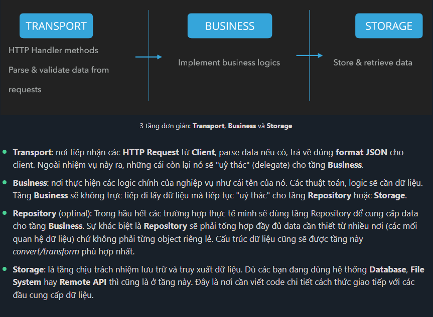

# Architecture
- Transport Layer (Parse data from request/socket)
- Business Layer (Do some logic)
- Storage Layer (Integrate with DB)

- Modules:
    - Model: Entity of the SQL
    - Storage: Working with DB
    - Biz: Do logic (Only receive data, Do nothing with DB - No gin, header, v.v)
    - Transport: Parse data
# Golang
- Tất cả các hàm có io nên đặt context
- type lowercase for first letter is not public and otherwise. Use function to return (`see in modules/**/storage`)
- Dùng injection:
```
// Not public
type createRestaurantBiz struct {
	store CreateRestaurantStore
}

func NewCreateRestaurantBiz(store CreateRestaurantStore) *createRestaurantBiz {
	return &createRestaurantBiz{store: store}
}
```
- Interface xài ở đâu nên khai báo ở đó
- Tạo app_context để sau này có thêm redis hay mongo sẽ không phải thêm parameters (trong transportation)
- tag `form` dùng khi muốn nhận được luôn giá trị trên query string
- `ShouldBind`: nạp data vào nếu có